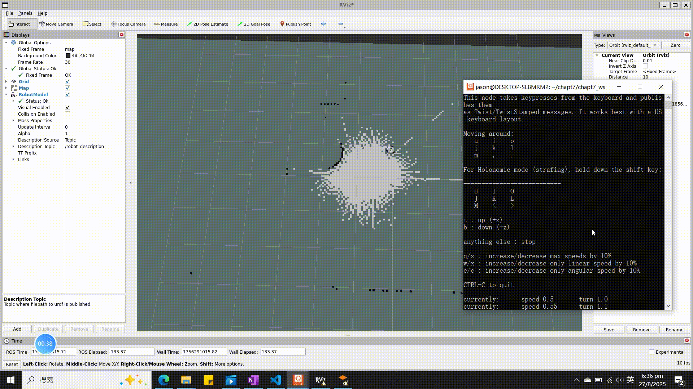
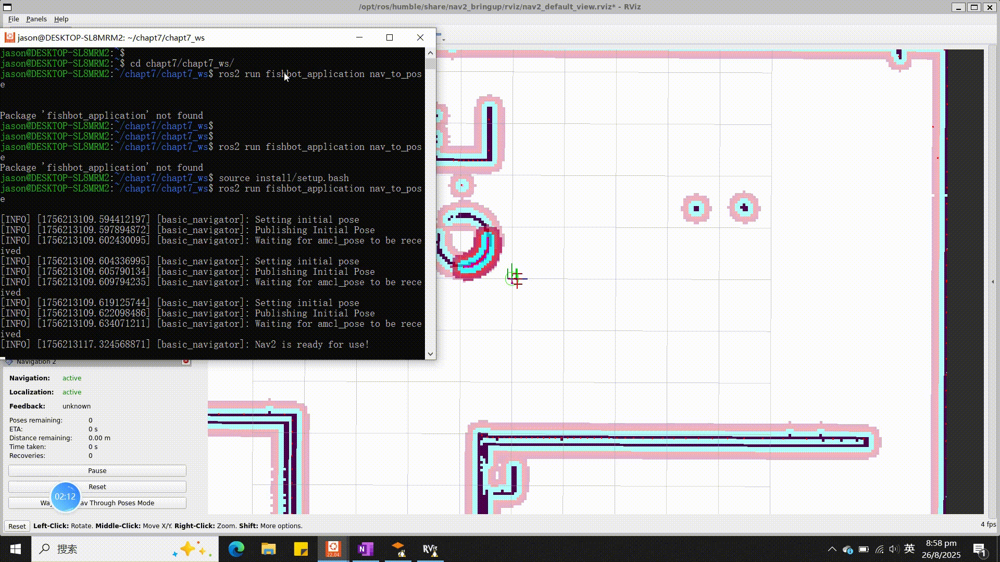
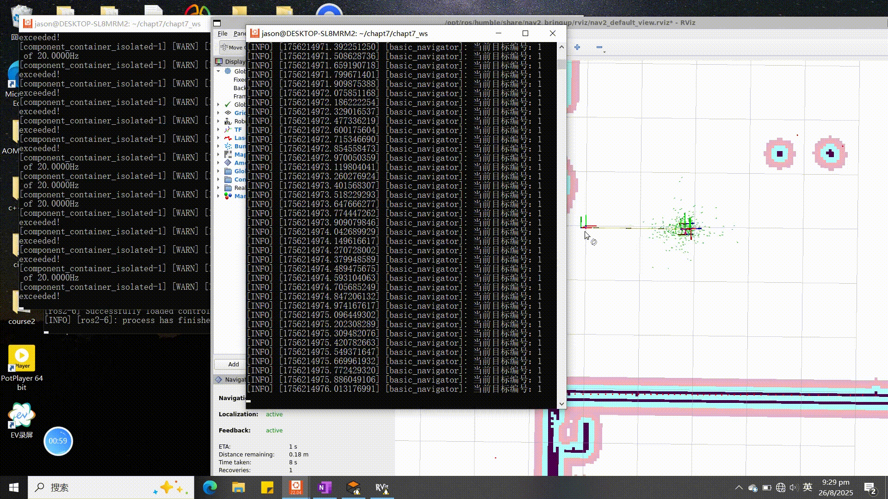

# ROS2 Humble Differential Drive Robot Simulation
A comprehensive simulation project for a two-wheeled differential drive robot using ROS2 Humble, Gazebo, and Rviz2. This project integrates the Navigation2 framework to enable both single-point and waypoint navigation capabilities.
## Overview
This repository contains a complete simulation stack for a differential drive robot, including:

- URDF/Xacro robot description
- Gazebo simulation environment
- ROS2 Humble nodes for control and perception
- Navigation2 integration for autonomous navigation
- Rviz2 configuration for visualization

The robot is equipped with essential sensors (LiDAR, IMU, and odometry) to enable SLAM and navigation in unknown environments.
## Features
- Accurate Dynamics: Realistic differential drive kinematics and dynamics
- Sensor Simulation: LiDAR, IMU, and wheel odometry
- Autonomous Navigation:
 - Single point goal navigation
 - Waypoint following
 - Obstacle avoidance
- SLAM Capabilities: Simultaneous Localization and Mapping
- Visualization: Comprehensive Rviz2 configuration
## Prerequisites
- ROS2 Humble
- Gazebo (Garden or newer)
- Navigation2
- colcon
- xacro
- tf2
## Installation
1. Create a ROS2 workspace:
```bash
mkdir -p ~/ros2_ws/src
cd ~/ros2_ws/src
```

2. Clone this repository:
```bash
git clone https://github.com/709519923/ROS_robot.git
```

3. Install dependencies:
```bash
cd ~/ros2_ws
rosdep install -i --from-path src --rosdistro humble -y
```

4. Build the workspace:
```bash
colcon build
source install/setup.bash
```
## Usage
### SLAM
Open four terminals and enter the following commands respectively:
```bash
ros2 launch slam_toolbox online_async_launch.py use_sim_time:=True
ros2 launch fishbot_description gazebo_sim.launch.py
ros2 run rviz2 rviz2 
 ros2 run teleop_twist_keyboard  teleop_twist_keyboard
```


### Navigation
- singlepoint navigation


- waypoint navigation


## Project Structure
1.导航相关节点
2.模型相关文件
3.rviz2 with nav2框架
└── src
    ├── fishbot_application
    │   ├── fishbot_application  //node
    │   ├── package.xml 
    │   ├── resource
    │   ├── setup.cfg
    │   ├── setup.py   //register node
    │   └── test
    ├── fishbot_description
    │   ├── CMakeLists.txt
    │   ├── LICENSE
    │   ├── build
    │   ├── config   //rviz2 config. & ros2_controller config.
    │   ├── include
    │   ├── 
    │   ├── 
    │   ├── log
    │   ├── package.xml
    │   ├── src
    │   ├── urdf    //structure description for robot model 
    │   └── world   // maps description for gazebo
    └── fishbot_navigation2
        ├── CMakeLists.txt
        ├── config
        ├── include
        ├── launch
        ├── maps  //SLAM maps
        ├── package.xml
        └── src
## Screenshots
### SLAM

### Single Point Navigation

### Waypoint Navigation

## Acknowledgments
- ROS2 Documentation
- Navigation2 Framework
- Gazebo Simulator
